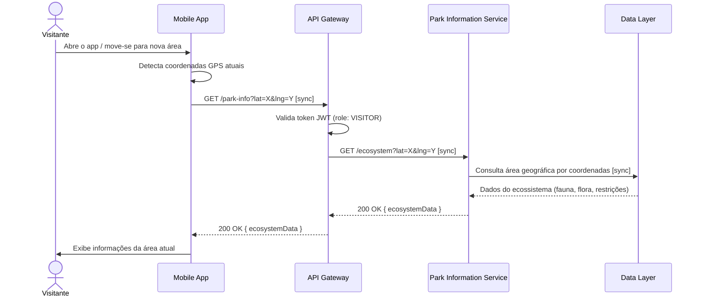
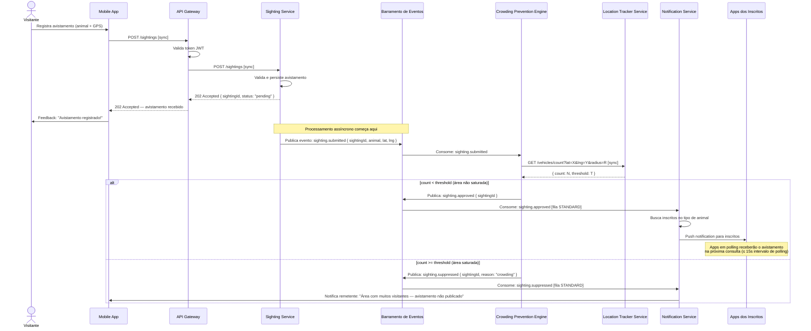
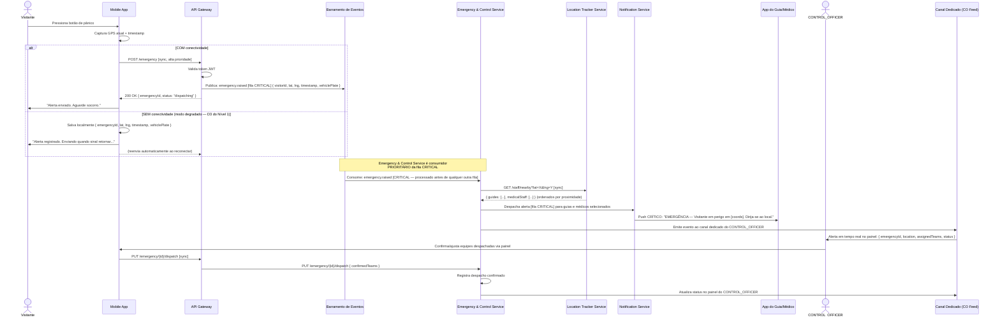
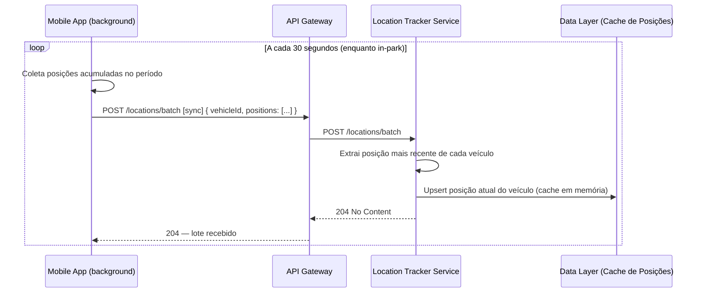

# Nível 3 — Interações ✅ APROVADO

> **Status:** Aprovado pelo grupo  
> **Grupo:** Walter Monteiro · Claudino Neto · Vinícius Seabra  
> **Data:** 08/06/2026  
> **Baseado em:** Nível 1 (Capacidades) + Nível 2 (Componentes)

---

## Decisões de Interação

| Decisão | Escolha |
|---------|---------|
| D3.1 — Padrão geral | **Híbrido:** síncrono para leituras e operações que exigem resposta imediata; assíncrono via barramento de eventos para processamento em pipeline |
| D3.2 — Envio de localização | **Lote a cada 30s:** app acumula posições localmente e envia pacote para o Location Tracker |
| D3.3 — Atualização do mapa | **Polling:** app consulta o servidor a cada intervalo (alvo: ~15s) para buscar avistamentos novos, dentro do SLO de 30s |
| D3.4 — Botão de pânico | **Barramento de eventos com fila CRITICAL:** alerta entra no bus como `emergency.raised [CRITICAL]`; Emergency & Control Service é consumidor prioritário dessa fila |
| D3.5 — Feed do CONTROL_OFFICER | **Canal dedicado:** conexão persistente exclusiva para o oficial, com feed completo do parque (todos os veículos, avistamentos, emergências ativas) |

---

## Padrão Híbrido — Regras Gerais

```
SÍNCRONO (chamada direta, aguarda resposta):
  ✅ Leituras: buscar info de ecossistema, tiles de mapa, dados do perfil
  ✅ Registro inicial: submeter avistamento (retorna 202 Accepted imediatamente)
  ✅ Consultas de estado: Location Tracker consultado pelo Crowding Engine
  ✅ Rota de emergência: Mobile App → API Gateway → Event Bus [CRITICAL]

ASSÍNCRONO (barramento de eventos, processamento em background):
  ✅ Pipeline de avistamento: Sighting → Crowding → Notification
  ✅ Alertas de emergência: Emergency [CRITICAL] → Dispatcher → Notificação das equipes
  ✅ Broadcast de mapa: aprovação de avistamento → atualização disponível para polling

CONEXÃO PERSISTENTE (canal aberto, servidor empurra dados):
  ✅ Exclusivo para CONTROL_OFFICER: feed completo do parque em tempo real
```

---

## Diagrama de Sequência — Fluxo 1: Informações Gerais

> Visitante entra em uma área do parque e o app exibe informações do ecossistema local.



---

## Diagrama de Sequência — Fluxo 2: Avistamento + Crowding + Notificação

> Visitante registra avistamento. Sistema verifica aglomeração e decide publicar ou suprimir.



> **SLO de 30s:** o pipeline completo (POST → evento aprovado → push) deve completar em ≤ 30 segundos.  
> **Polling do mapa:** visitantes consultam novos avistamentos a cada ~15s. Um avistamento aprovado estará disponível na próxima consulta após a aprovação.

---

## Diagrama de Sequência — Fluxo 3: Botão de Pânico → Despacho → Coordenação

> Visitante aciona emergência. Sistema identifica equipes mais próximas. CONTROL_OFFICER coordena resposta.



---

## Diagrama de Sequência — Fluxo 4: Envio de Localização em Lote (Background)

> O app acumula posições e envia em lote a cada 30 segundos para o Location Tracker.



---

## Eventos do Barramento — Inventário Preliminar

| Evento | Fila | Produtor | Consumidor(es) |
|--------|------|----------|----------------|
| `sighting.submitted` | STANDARD | Sighting Service | Crowding Prevention Engine |
| `sighting.approved` | STANDARD | Crowding Prevention Engine | Notification Service |
| `sighting.suppressed` | STANDARD | Crowding Prevention Engine | Notification Service |
| `emergency.raised` | **CRITICAL** | API Gateway | Emergency & Control Service |
| `emergency.dispatched` | **CRITICAL** | Emergency & Control Service | Notification Service, CO Feed |

---

## Implicações de Design Identificadas

1. **SLO de 30s é apertado para Polling:** Com polling a cada 15s e pipeline assíncrono, o caminho crítico é: `POST sighting → evento → crowding check → aprovação → disponível no polling`. Esses passos precisam completar em menos de 15s para garantir que a próxima janela de polling já traga o avistamento aprovado.

2. **Location Tracker como componente de leitura crítica:** Tanto o Crowding Prevention Engine quanto o Emergency & Control Service fazem consultas síncronas ao Location Tracker. Ele é um ponto de dependência crítica — precisa ser altamente disponível e de baixa latência.

3. **Canal dedicado do CONTROL_OFFICER:** É o único caso de conexão persistente servidor→cliente no sistema. Deve ser tolerante a reconexões (o CONTROL_OFFICER pode perder conexão e retomar sem perder o estado do parque).

4. **Deduplicação de emergências:** No modo degradado (offline queue), o mesmo alerta pode ser enviado mais de uma vez ao reconectar. O Emergency & Control Service deve detectar e ignorar duplicatas pelo `emergencyId` gerado localmente no app.
