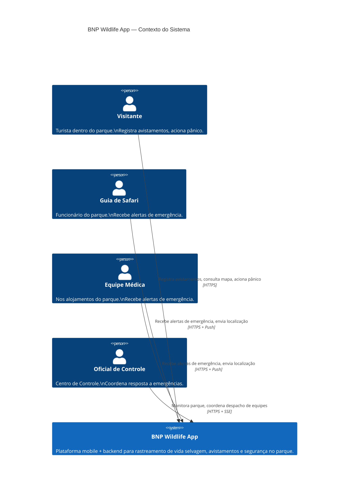
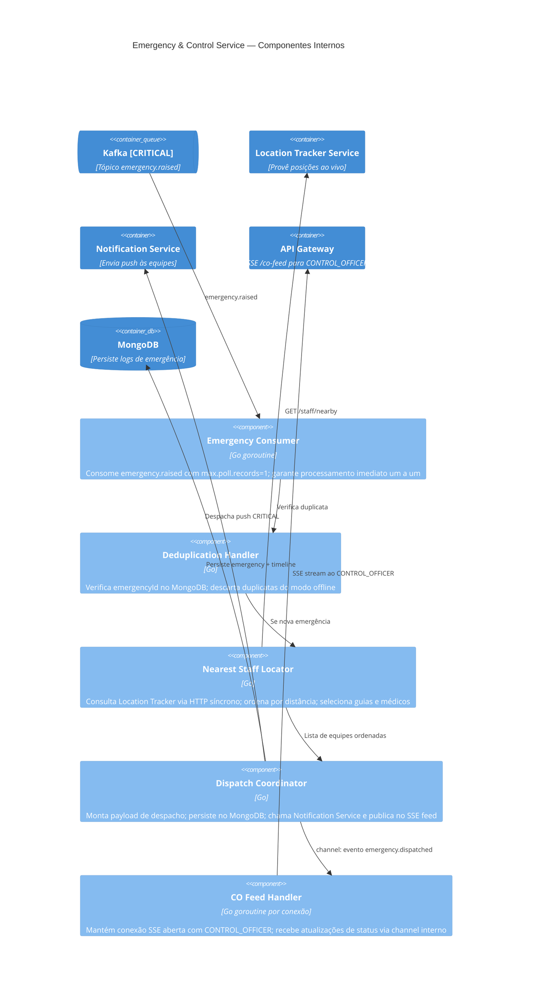
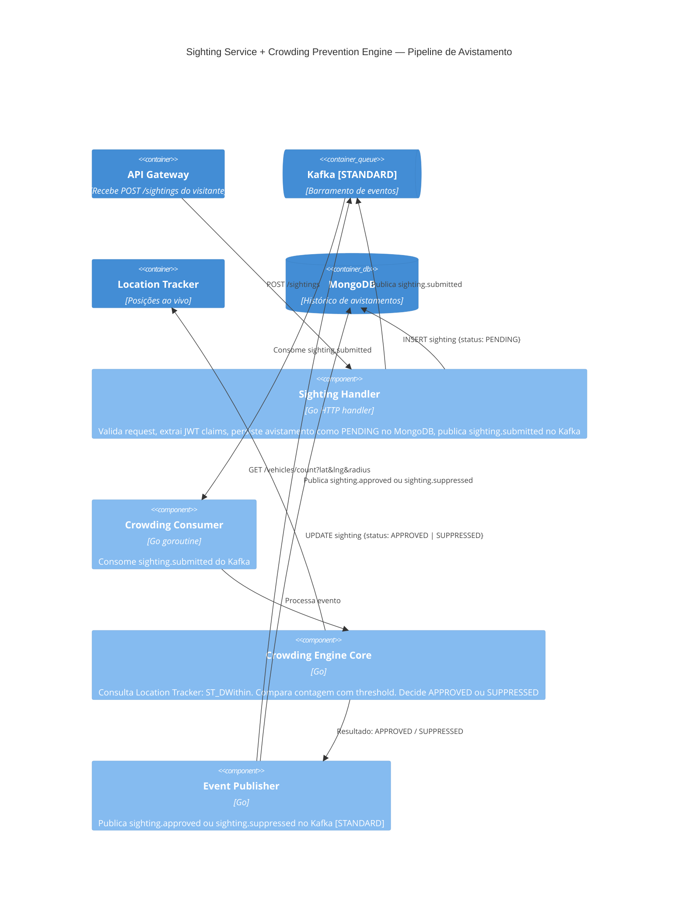

# Diagrama C4 Completo — BNP Wildlife App

> **Grupo:** Walter Monteiro · Claudino Neto · Vinícius Seabra  
> **Data:** 08/06/2026

---

## Nível 1: Contexto do Sistema



---

## Nível 2: Diagrama de Containers

```mermaid
C4Container
    title BNP Wildlife App — Containers

    Person(visitor, "Visitante / Staff", "Usuário do app mobile")
    Person(officer, "Oficial de Controle", "Acessa feed dedicado via app")

    Container(ios, "iOS App", "Swift / CoreLocation / APNs", "App nativo iOS para todos os roles")
    Container(android, "Android App", "Kotlin / FusedLocation / FCM", "App nativo Android para todos os roles")
    Container(gateway, "API Gateway", "Go + chi", "Ponto de entrada único: autenticação JWT, roteamento, rate limiting, SSE /co-feed")

    Container(auth, "Auth & User Service", "Go", "Cadastro, login, emissão de tokens JWT com role claims")
    Container(parkinfo, "Park Information Service", "Go", "Dados de ecossistema por coordenadas GPS")
    Container(location, "Location Tracker Service", "Go", "Recebe lotes de GPS, mantém posição atual de todos os veículos/staff")
    Container(sighting, "Sighting Service", "Go", "Recebe avistamentos, persiste como PENDING, publica evento")
    Container(crowding, "Crowding Prevention Engine", "Go", "Conta veículos no raio do avistamento, decide APPROVED ou SUPPRESSED")
    Container(mapservice, "Map Service", "Go", "Serve tiles cartográficas do parque, manifesto para download offline")
    Container(notification, "Notification Service", "Go", "Gerencia assinaturas, despacha push notifications [STANDARD e CRITICAL]")
    Container(emergency, "Emergency & Control Service", "Go [ISOLADO]", "Ciclo completo de emergência: recebe, identifica equipes, despacha, coordena CONTROL_OFFICER")

    ContainerDb(postgres, "PostgreSQL + PostGIS", "PostgreSQL 16", "Usuários, veículos, posições ao vivo, áreas do parque")
    ContainerDb(mongo, "MongoDB", "MongoDB 7", "Histórico de avistamentos, catálogo de espécies, logs de emergência")
    ContainerQueue(kafka, "Apache Kafka", "Kafka 3 KRaft", "Barramento de eventos: tópicos STANDARD e CRITICAL")

    Rel(visitor, ios, "Usa")
    Rel(visitor, android, "Usa")
    Rel(officer, ios, "Usa (role: CONTROL_OFFICER)")
    Rel(officer, android, "Usa (role: CONTROL_OFFICER)")

    Rel(ios, gateway, "HTTPS / SSE")
    Rel(android, gateway, "HTTPS / SSE")

    Rel(gateway, auth, "POST /auth/*")
    Rel(gateway, parkinfo, "GET /park-info")
    Rel(gateway, sighting, "POST /sightings, GET /sightings")
    Rel(gateway, location, "POST /locations/batch")
    Rel(gateway, mapservice, "GET /map/tiles, GET /map/manifest")
    Rel(gateway, notification, "POST /subscriptions")
    Rel(gateway, emergency, "POST /emergency, PUT /emergency/{id}/dispatch")
    Rel(gateway, kafka, "Publica emergency.raised [CRITICAL]")

    Rel(sighting, kafka, "Publica sighting.submitted [STANDARD]")
    Rel(kafka, crowding, "Consome sighting.submitted")
    Rel(crowding, location, "GET /vehicles/count (sync)")
    Rel(crowding, kafka, "Publica sighting.approved ou sighting.suppressed [STANDARD]")
    Rel(kafka, notification, "Consome sighting.approved, sighting.suppressed")
    Rel(kafka, emergency, "Consome emergency.raised [CRITICAL — prioritário]")
    Rel(emergency, location, "GET /staff/nearby (sync)")
    Rel(emergency, notification, "Despacha push CRITICAL")
    Rel(emergency, gateway, "Emite eventos SSE ao /co-feed")

    Rel(auth, postgres, "R/W usuários e veículos")
    Rel(location, postgres, "R/W posições (PostGIS)")
    Rel(parkinfo, postgres, "R áreas do parque (PostGIS)")
    Rel(sighting, mongo, "W avistamentos")
    Rel(crowding, mongo, "R avistamentos recentes")
    Rel(notification, mongo, "R catálogo de espécies")
    Rel(emergency, mongo, "R/W logs de emergência")
    Rel(mapservice, postgres, "R áreas e bounds do parque")
```



---

## Nível 3: Internals do Emergency & Control Service



---

## Nível 4: Internals do Sighting + Crowding Pipeline



---

## Visão de Deploy — Kubernetes

```
Kubernetes Cluster
│
├── Namespace: bnp-critical
│   └── Pod: emergency-control-service
│       ├── PriorityClass: high-priority
│       ├── resources.requests: cpu=500m, memory=256Mi
│       └── resources.limits: cpu=1000m, memory=512Mi (dedicado, não compartilhado)
│
├── Namespace: bnp-services
│   ├── Deployment: api-gateway          (replicas: 3)
│   ├── Deployment: auth-user-service    (replicas: 2)
│   ├── Deployment: park-info-service    (replicas: 2)
│   ├── Deployment: location-tracker     (replicas: 3)
│   ├── Deployment: sighting-service     (replicas: 3)
│   ├── Deployment: crowding-engine      (replicas: 2)
│   ├── Deployment: map-service          (replicas: 2)
│   └── Deployment: notification-service (replicas: 2)
│
├── Namespace: bnp-data
│   ├── StatefulSet: postgres-cluster    (1 primary + 1 replica)
│   ├── StatefulSet: mongodb-replicaset  (3 nós)
│   └── StatefulSet: kafka-cluster       (3 brokers KRaft)
│
└── Ingress: HTTPS → api-gateway
```
