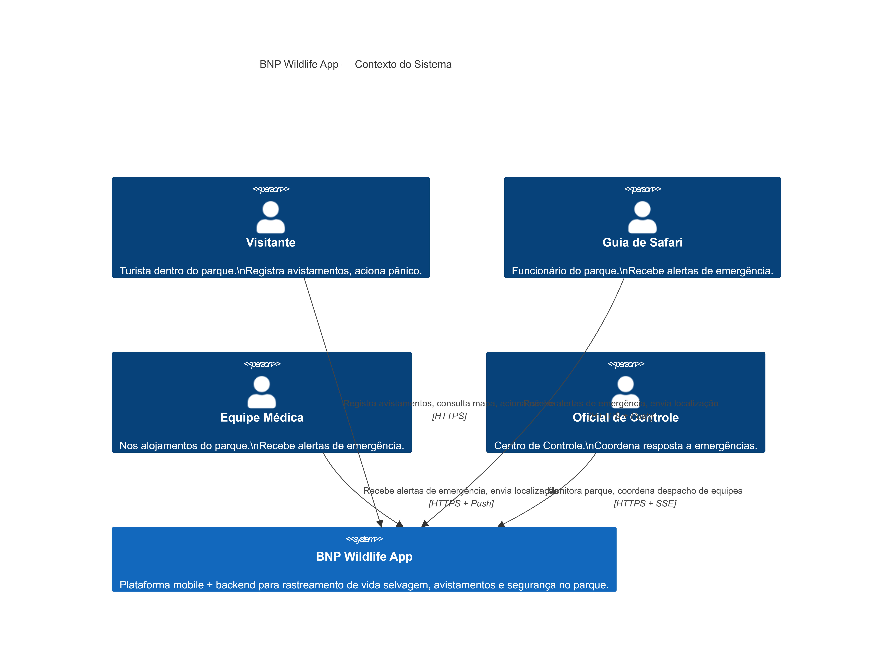
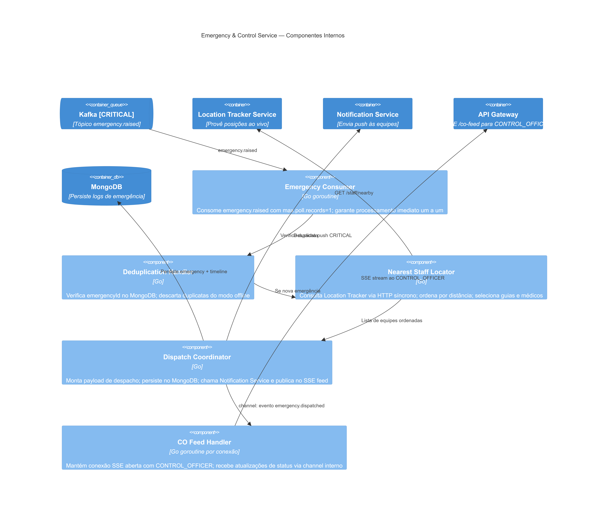
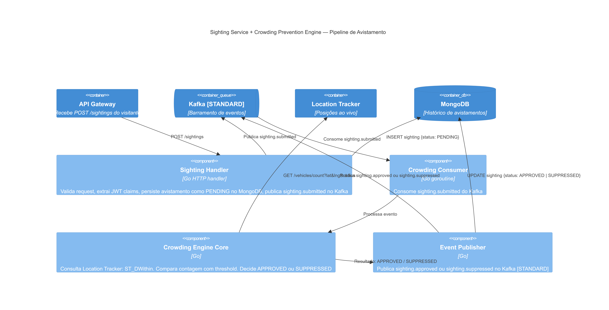
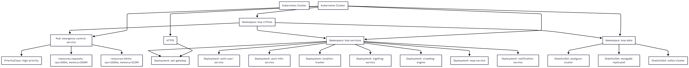

# Evidências da Atividade — BNP Wildlife App (Design-First)

> **Disciplina:** Arquitetura de Sistemas — Prof. Kiev Gama  
> **Grupo:** Walter Monteiro · Claudino Neto · Vinícius Seabra  
> **Data:** 08/06/2026  
> **Entregável:** PDFs/Docs com evidências da arquitetura produzida

---

## 1. LLM Utilizado

| Campo | Valor |
|-------|-------|
| **Nome do modelo** | Claude Sonnet 4.6 (Anthropic) |
| **Interface usada** | Antigravity IDE (assistente de codificação) |
| **Sessão iniciada** | 08/06/2026 — 14h54 (horário de Brasília) |
| **Método de interação** | Design-First em 5 níveis progressivos — nenhuma implementação gerada antes da aprovação de todos os contratos |

---

## 2. Metodologia Aplicada

Baseada no artigo **"Design-First Collaboration"** de Rahul Garg (Fowler Blog, março/2026), disponível em:  
`00_referencias/blog.txt`

**Princípio central seguido:**
> *"Nenhum código e nenhuma tecnologia específica serão escolhidos antes que os níveis de Capacidades, Componentes, Interações e Contratos sejam aprovados pelo grupo."*

**Os 5 níveis percorridos:**
```
NÍVEL 1: CAPACIDADES    → aprovado em sessão com o grupo
NÍVEL 2: COMPONENTES    → aprovado em sessão com o grupo
NÍVEL 3: INTERAÇÕES     → aprovado em sessão com o grupo
NÍVEL 4: CONTRATOS      → aprovado em sessão com o grupo
NÍVEL 5: IMPLEMENTAÇÃO  → gerado apenas após aprovação completa
```

---

## 3. Transcrição Literal dos Prompts e Respostas

### 3.1 — Prompt de Abertura (enviado pelo grupo ao agente)

```
Primeiramente, entenda os arquivos que já existem nesse diretório:

faculdade\arquitetura_software\desc_atividade.txt: Esse arquivo txt contém a atividade
que deve ser desenvolvida e os entregáveis esperados. O documento a parte explicando as
opiniões do grupo nós iremos fazer por último. Essa atividade é da disciplina de
Arquitetura de Sistemas do professor Kiev Gama e os alunos que compõe o grupo são:
Walter Monteiro, Claudino Neto e Vinícius Seabra.

faculdade\arquitetura_software\blog.txt: Esse arquivo representa o texto do blog
recomendado para leitura.

faculdade\arquitetura_software\Designing with AI_ Nature Park Wildlife App.pdf: PDF da
descrição do projeto que deve ser construído entre o grupo e as ferramentas de IA.

faculdade\arquitetura_software\Proposta de Arquitetura de Software definida pelo
Gemini_Grupo.pdf: Essa foi a proposta que o grupo desenvolveu na semana passada.

Desenvolva um plano de ação com base em um AGENT.MD que será basicamente um especialista
em design system que vai ajudar o grupo a elaborar a estrutura da plataforma que deve
ser construída com base nessa atividade.
```

**→ Ação do agente:** leu todos os arquivos (desc_atividade.txt, blog.txt, ambos os PDFs via PyPDF2) e criou o `AGENT.md` com o guia metodológico Design-First em 5 níveis.

---

### 3.2 — Prompt de Início da Sessão de Design

```
Vamos definir cada nível do projeto junto com você. Simule que eu e o grupo discutimos
sobre as possibilidades para que escolhêssemos alguma. Nesse sentido as possibilidades
é você quem nos dará e nós escolheremos como se tivessem sido alguma de nossas ideias.
[...] Faça isso começando do nível 1. E elabore um documento só com as respostas para
você se basear e prosseguir à medida que fomos escolhendo.
```

**→ Ação do agente:** apresentou 2–3 opções concretas para cada pergunta do Nível 1, com prós, contras e implicações técnicas.

---

### 3.3 — Prompt de Aprovação do Nível 1

```
NIVEL 1:
Pergunta 1: Resposta - Opção A — Apenas dentro do parque (geo-fenced)
Pergunta 2: Resposta - Opção B — ≤ 30 segundos ("reasonable time" conforme o enunciado)
Pergunta 3: Resposta - Opção C — Modo degradado: GPS + armazenamento local + reenvio quando reconectar
Pergunta 4: Resposta: Opção B — Tudo no mesmo app (roles diferentes)
Pergunta 5: Resposta: Opção A — Mesmo app, perfis diferentes via login
Pergunta 6: Resposta: Opção A — Nenhum sistema legado relevante (greenfield)
```

**→ Ação do agente:** registrou `01_design/nivel_1_capacidades.md` e apresentou as opções do Nível 2.

---

### 3.4 — Prompt de Aprovação do Nível 2

```
NIVEL 2:
Pergunta 2.1: Resposta - Opção B — Serviço independente: Crowding Prevention Engine
Pergunta 2.2: Resposta - Opção B — Location Tracker dedicado: carros enviam GPS continuamente em background
Pergunta 2.3: Resposta - Opção A — O próprio backend serve as tiles do mapa (Map Service próprio)
Pergunta 2.4: Resposta - Opção C — Notification Service único com filas de prioridade interna (HIGH/LOW)
Pergunta 2.5: Resposta - Opção A — Emergency & Control Service completamente isolado, com recursos dedicados
```

**→ Ação do agente:** registrou `01_design/nivel_2_componentes.md` com lista definitiva de 10 componentes e diagrama C4 textual. Apresentou as opções do Nível 3.

---

### 3.5 — Prompt de Aprovação do Nível 3

```
NIVEL 3:
Pergunta 3.1: Resposta - Opção C — Híbrido: síncrono para leituras e operações críticas; assíncrono para processamento de eventos
Pergunta 3.2: Resposta - Opção C — Envio em lote: app acumula posições localmente e envia pacotes a cada 30s
Pergunta 3.3: Resposta - Opção A — O app faz polling: consulta o servidor a cada X segundos para buscar avistamentos novos
Pergunta 3.4: Resposta - Opção B — Entra no barramento de eventos como CRITICAL, mas com consumidor prioritário
Pergunta 3.5: Resposta - Opção B — Canal dedicado para o CONTROL_OFFICER com feed completo do parque
```

**→ Ação do agente:** registrou `01_design/nivel_3_interacoes.md` com 4 diagramas de sequência em Mermaid. Apresentou as opções do Nível 4.

---

### 3.6 — Prompt de Aprovação do Nível 4

```
NIVEL 4:
Pergunta 4.1: Resposta - Opção A  [Token auto-suficiente com role embutido]
Pergunta 4.2: Resposta - Opção B  [speciesId referenciando catálogo do backend]
Pergunta 4.3: Resposta - Opção B  [Array de todas as posições do período]
Pergunta 4.4: Resposta - Opção B  [Resposta síncrona até o despacho com equipes + ETA]
Pergunta 4.5: Resposta - Opção A  [Retorna todos avistamentos; app filtra localmente]
```

**→ Ação do agente:** registrou `01_design/nivel_4_contratos.md` com 9 endpoints, 5 schemas de eventos e padrão de erros. Apresentou as opções do Nível 5.

---

### 3.7 — Prompt de Aprovação do Nível 5

```
NIVEL 5:
Pergunta 5.1: Resposta - Opção A  [Apache Kafka]
Pergunta 5.2: Resposta - Opção B  [PostgreSQL + MongoDB]
Pergunta 5.3: Resposta - Opção B  [PostgreSQL + PostGIS para Location Tracker]
Pergunta 5.4: Resposta - Opção B  [Server-Sent Events para CONTROL_OFFICER]
Pergunta 5.5: Resposta - Opção C  [Apps nativos: Swift (iOS) + Kotlin (Android)]
Pergunta 5.6: Resposta - Opção C  [Go (Golang) para o backend]
```

**→ Ação do agente:** gerou todos os artefatos finais: `stack_tecnologica.md`, 5 ADRs, `diagrama_c4_completo.md` (C4 em 3 níveis + visão de deploy Kubernetes), `comparativo_propostas.md`.

---

## 4. Decisões Arquiteturais — Resumo Completo

### Nível 1 — Capacidades (6 decisões)
| # | Pergunta | Opção escolhida |
|---|----------|-----------------|
| 1.1 | Escopo geográfico | A — Apenas dentro do parque (geo-fenced) |
| 1.2 | SLO de avistamentos | B — ≤ 30 segundos |
| 1.3 | Botão de pânico offline | C — GPS local + reenvio ao reconectar |
| 1.4 | Arquitetura de clientes | B — Um único app com roles |
| 1.5 | Autenticação | A — Mesmo app, perfis via login |
| 1.6 | Sistemas legados | A — Greenfield |

### Nível 2 — Componentes (5 decisões)
| # | Pergunta | Opção escolhida |
|---|----------|-----------------|
| 2.1 | Crowding Prevention | B — Serviço independente |
| 2.2 | Location Tracker | B — Serviço dedicado com GPS contínuo |
| 2.3 | Map Service | A — Backend serve tiles próprias |
| 2.4 | Notification Service | C — Único com filas CRITICAL/STANDARD |
| 2.5 | Emergency Service | A — Isolado com recursos dedicados |

### Nível 3 — Interações (5 decisões)
| # | Pergunta | Opção escolhida |
|---|----------|-----------------|
| 3.1 | Padrão geral | C — Híbrido síncrono/assíncrono |
| 3.2 | Envio de localização | C — Lote a cada 30s |
| 3.3 | Atualização do mapa | A — Polling a cada ~15s |
| 3.4 | Botão de pânico | B — Barramento com fila CRITICAL |
| 3.5 | Feed CONTROL_OFFICER | B — Canal SSE dedicado |

### Nível 4 — Contratos (5 decisões)
| # | Pergunta | Opção escolhida |
|---|----------|-----------------|
| 4.1 | Token | A — Auto-suficiente com role embutido |
| 4.2 | Tipo de animal | B — speciesId via catálogo do backend |
| 4.3 | Localização em lote | B — Array de trajetória dos 30s |
| 4.4 | Resposta emergência | B — Síncrono até despacho com ETA |
| 4.5 | Polling do mapa | A — Todos os avistamentos, app filtra |

### Nível 5 — Implementação (6 decisões)
| # | Pergunta | Opção escolhida |
|---|----------|-----------------|
| 5.1 | Barramento de eventos | A — Apache Kafka |
| 5.2 | Banco de dados | B — PostgreSQL + MongoDB |
| 5.3 | Location Tracker storage | B — PostgreSQL + PostGIS |
| 5.4 | Real-time CO | B — Server-Sent Events (SSE) |
| 5.5 | Mobile | C — Nativo: Swift + Kotlin |
| 5.6 | Backend | C — Go (Golang) |

**Total: 27 decisões tomadas pelo grupo ao longo de 5 níveis.**

---

## 5. Artefatos Produzidos

| Arquivo | Tipo | Conteúdo |
|---------|------|----------|
| `01_design/nivel_1_capacidades.md` | Decisão | 6 capacidades IN SCOPE, 7 OUT OF SCOPE |
| `01_design/nivel_2_componentes.md` | Decisão | 10 componentes + diagrama C4 textual |
| `01_design/nivel_3_interacoes.md` | Decisão + Diagramas | 4 diagramas de sequência Mermaid |
| `01_design/nivel_4_contratos.md` | Decisão + Schemas | 9 endpoints API + 5 eventos + padrão de erros |
| `02_implementacao/stack_tecnologica.md` | Implementação | Stack completa com configurações por componente |
| `02_implementacao/diagramas/diagrama_c4_completo.md` | Diagramas | C4 Context + Container + Component (×2) + Deploy |
| `02_implementacao/adrs/adr_001_event_broker.md` | ADR | Kafka vs RabbitMQ |
| `02_implementacao/adrs/adr_002_database_strategy.md` | ADR | PostgreSQL+PostGIS + MongoDB |
| `02_implementacao/adrs/adr_003_realtime_protocol.md` | ADR | SSE vs WebSocket |
| `02_implementacao/adrs/adr_004_mobile_platform.md` | ADR | Nativo vs Cross-platform |
| `02_implementacao/adrs/adr_005_backend_language.md` | ADR | Go vs Node.js vs Python |
| `03_entregaveis/comparativo_propostas.md` | Entregável | Comparativo proposta anterior vs nova |

---

## 6. Diagrama de Arquitetura Final — Resumo Visual

```
┌──────────────────────────────────────────────────────────────────┐
│                    CLIENTES                                      │
│   iOS App (Swift)              Android App (Kotlin)              │
│   CoreLocation + APNs          FusedLocation + FCM               │
│   Core Data (offline queue)    Room DB (offline queue)           │
└────────────────────────┬─────────────────────────────────────────┘
                         │ HTTPS
              ┌──────────▼──────────┐
              │    API Gateway (Go)  │
              │  JWT · Rate Limit    │
              │  Routing · SSE/co-feed│
              └──────────┬──────────┘
          ┌──────────────┼──────────────────┐
          │              │                  │
    ┌─────▼──────┐ ┌─────▼──────┐  ┌───────▼──────────────┐
    │Auth & User │ │Park Info   │  │  Location Tracker    │
    │Service(Go) │ │Service(Go) │  │  Service (Go)        │
    └─────┬──────┘ └────────────┘  └───────┬──────────────┘
          │                                │
    ┌─────▼──────┐   ┌──────────┐  ┌──────▼──────────────┐
    │  Sighting  │──►│  KAFKA   │  │  Crowding Prevention │
    │Service(Go) │   │[STANDARD]│◄─│  Engine (Go)        │
    └────────────┘   └────┬─────┘  └────────────────────┘
                          │
                   ┌──────▼──────┐
                   │Notification │
                   │ Service(Go) │
                   │[CRIT./STD.] │
                   └─────────────┘
    ┌─────────────────────────────────────────┐
    │  Emergency & Control Service (Go)       │
    │  ⚠️  ISOLADO — K8s namespace dedicado   │
    │  Kafka[CRITICAL] → Location → Dispatch  │
    └─────────────────────────────────────────┘

DADOS:
  PostgreSQL 16 + PostGIS  →  usuários, veículos, localizações ao vivo, áreas
  MongoDB 7                →  avistamentos, espécies, logs de emergência
  Apache Kafka (KRaft)     →  barramento de eventos (tópicos CRITICAL e STANDARD)
```

---

## 7. Diagramas de Arquitetura — Renderizados

Todos os diagramas foram renderizados via **[mermaid.live](https://mermaid.live)** e estão salvos em:  
`02_implementacao/diagramas/fotos/`

---

### 7.1 — C4 Context: Atores externos e o sistema BNP

> Mostra os 4 tipos de usuários (Visitante, Guia de Safari, Equipe Médica, Oficial de Controle) e suas interações com o sistema BNP Wildlife App.



---

### 7.2 — C4 Container: Todos os 10 componentes com tecnologias e relações

> Visão completa da arquitetura de containers: iOS App, Android App, API Gateway, todos os microserviços em Go, e as três camadas de dados (PostgreSQL+PostGIS, MongoDB, Apache Kafka).


---

### 7.3 — C4 Component: Emergency & Control Service (serviço crítico isolado)

> Internals do serviço de emergência: Emergency Consumer (goroutine com max.poll.records=1), Deduplication Handler, Nearest Staff Locator, Dispatch Coordinator e CO Feed Handler (SSE).



---

### 7.4 — C4 Component: Sighting + Crowding Pipeline

> Pipeline de avistamento: Sighting Handler publica evento no Kafka [STANDARD] → Crowding Consumer → Crowding Engine Core consulta Location Tracker → Event Publisher aprova ou suprime.



---

### 7.5 — Visão de Deploy Kubernetes

> Namespaces separados: `bnp-critical` (Emergency Service isolado com PriorityClass e recursos dedicados), `bnp-services` (demais microserviços com réplicas), `bnp-data` (PostgreSQL, MongoDB, Kafka em StatefulSets).



---

## 8. Espaço para Opiniões do Grupo

> *Esta seção deve ser preenchida pelos integrantes do grupo com suas próprias palavras. O professor Kiev Gama pediu explicitamente a opinião de vocês — não do LLM.*

### Walter Monteiro
Eu acredito que a abordagem Design-First (5 níveis) melhorou significativamente a qualidade das decisões, pois o processo de analisar cada nível de forma separada nos obriga a questionar cada decisão, o que evita armadilhas como a “Implementation Trap” vista na proposta anterior. Essa abordagem progressiva garante que as decisões de alto nível sejam tomadas e validadas antes de avançarmos para os detalhes de implementação, resultando em uma arquitetura mais robusta e bem pensada.

 O processo de escolher entre múltiplas opções concretas nos ajudou a visualizar as implicações de cada escolha, tornando as decisões mais conscientes e alinhadas com os objetivos do projeto. Isso é fundamental em projetos reais, onde uma decisão mal tomada no início pode ter consequências significativas mais tarde.

Comparado à proposta anterior, que foi gerada pela IA sem o mesmo nível de questionamento, percebo que sem essa abordagem estruturada, corremos o risco de ignorar requisitos críticos ou escolher tecnologias baseadas em preferências superficiais em vez de análises cuidadosas. A falta de perguntas norteadoras na proposta anterior poderia levar a uma arquitetura frágil, incapaz de lidar com cenários críticos como emergências ou picos de uso.

A separação em 5 níveis progressivos aumentou o tempo de desenvolvimento, mas o investimento valeu a pena. Em projetos menores, como este, essa abordagem é especialmente útil, pois garante que a arquitetura seja sólida desde o início. Em projetos maiores, essa abordagem se tornaria ainda mais crítica para garantir a qualidade e manutenibilidade do sistema.

Contudo, como foi um processo ainda muito baseado no uso de IA, acredito que teríamos uma melhor visibilidade da diferença das duas arquiteturas propostas se tivéssemos uma base técnica melhor para avaliar o que foi proposto.

### Claudino Neto
*(escreva sua opinião aqui)*

### Vinícius Seabra
*(escreva sua opinião aqui)*

---

### Perguntas norteadoras para as opiniões
1. A abordagem Design-First (5 níveis) mudou a qualidade das decisões tomadas? Por quê?
2. Quais decisões foram as mais difíceis de tomar? O que o processo de escolher entre opções concretas trouxe de diferente?
3. A proposta anterior foi gerada pela IA sem nenhuma dessas perguntas — qual o risco disso em um projeto real?
4. O Location Tracker "invisível" na proposta anterior é um exemplo da "Implementation Trap" do blog? Como vocês enxergam isso?
5. A separação em 5 níveis progressivos custou mais tempo. Valeu a pena? Em que contextos você usaria isso?
6. Houve alguma decisão que vocês tomariam diferente agora, olhando para o resultado final?
